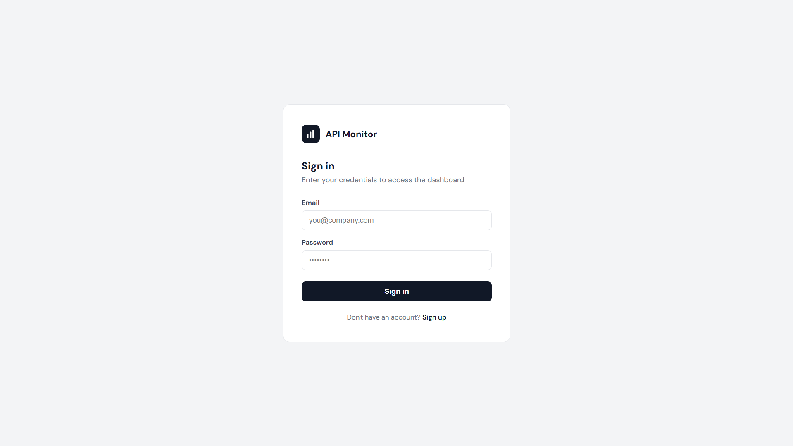
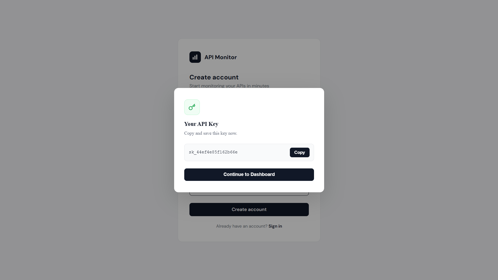
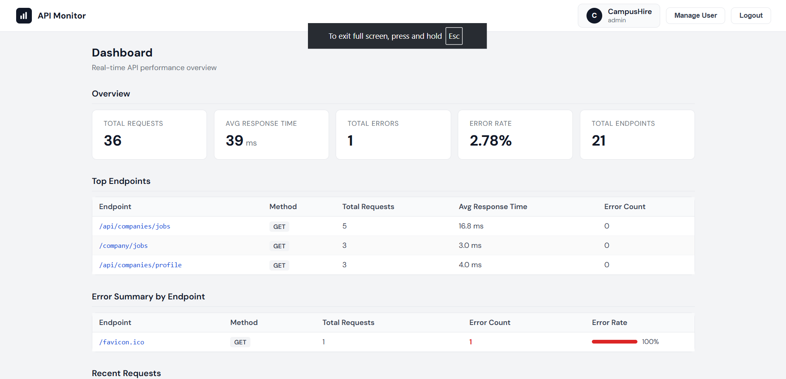
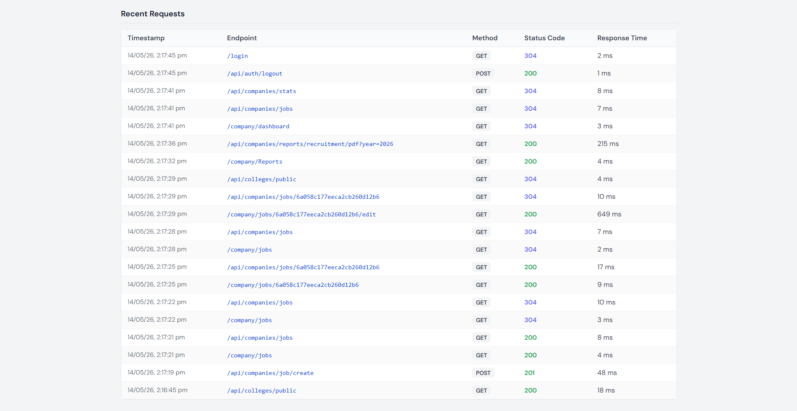
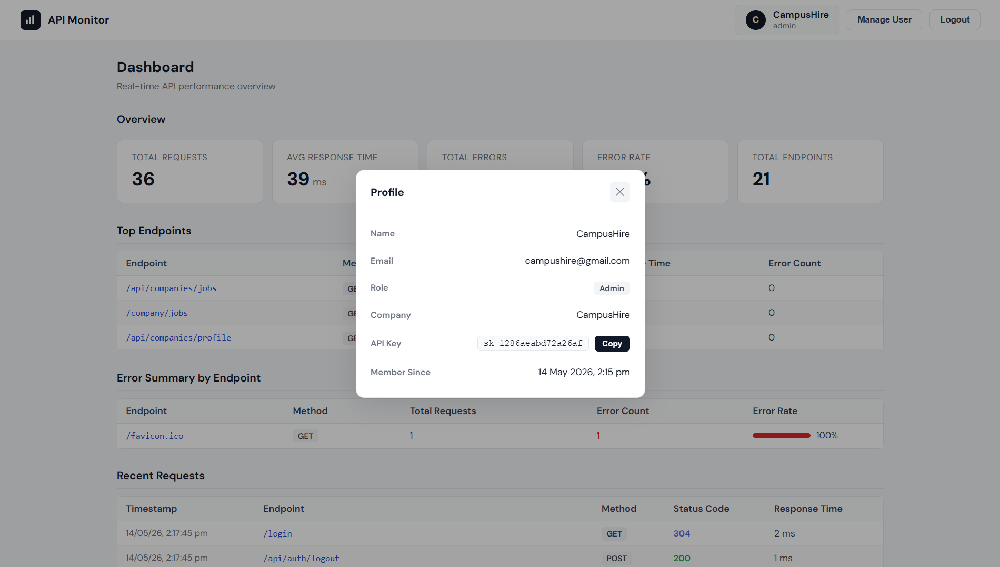
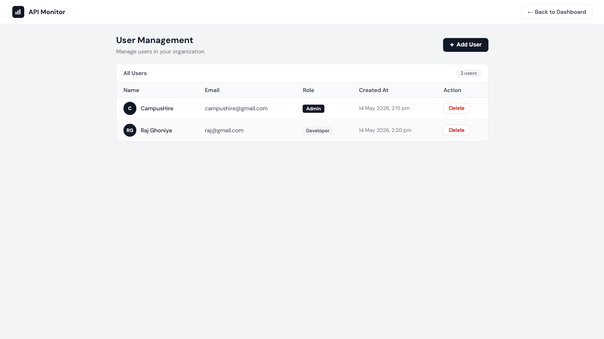

# Real-Time Backend Analytics & Monitoring Service

A MERN stack SaaS platform that allows developers and companies to monitor backend APIs in real time through a centralized dashboard.

---

## Overview

This system provides a backend analytics service where developers can track:

* API usage
* Performance (response time)
* Error rates (4xx/5xx)
* Recent request activity

It works by integrating an analytics middleware into backend applications. This middleware automatically captures API request data and sends it to the SaaS platform.

---

## Features

### Analytics Monitoring

* Tracks every API request
* Measures response time
* Captures HTTP status codes
* Stores request logs for analysis

### Dashboard Analytics

* Total API requests
* Average response time
* Error rate
* Most used endpoints
* Recent API activity

### Multi-Tenant Architecture

* Each company is treated as a tenant
* Data is isolated using tenantId
* Each tenant can have multiple users

### User Management (RBAC)

* Admin user created during registration
* Admin can create and delete users
* Developers can only view analytics
* Role-based access control enforced using JWT

---

## Tech Stack

### Backend

* Node.js
* Express.js
* MongoDB (Mongoose)

### Frontend

* React.js

### Authentication

* JWT (stored in HTTP-only cookies)

---

## Project Structure

```id="projstruct"
backend
│
├── config
│   └── db.js
│
├── models
│   ├── Tenant.js
│   ├── User.js
│   ├── RequestLog.js
│   └── AggregatedMetric.js
│
├── controllers
│   ├── authController.js
│   ├── analyticsController.js
│   └── dashboardController.js
│
├── routes
│   ├── authRoutes.js
│   ├── analyticsRoutes.js
│   └── dashboardRoutes.js
│
├── middleware
│   └── authMiddleware.js
│
├── services
│   └── analyticsService.js
│
├── utils
│   └── generateApiKey.js
│
└── server.js
```

---

## System Workflow

```id="workflow"
Client Request
     ↓
Developer Backend
     ↓
Analytics Middleware
     ↓
POST /api/analytics
     ↓
MongoDB (request_logs + aggregated_metrics)
     ↓
Dashboard APIs
     ↓
Frontend Dashboard
```

## Database Design

### tenants

Stores companies using the platform.

Fields:

* companyName
* email
* apiKey
* createdAt

---

### users

Stores users for each tenant.

Fields:

* tenantId
* name
* email
* password
* role (admin or developer)
* createdAt

---

### request_logs

Stores every API request received.

Fields:

* tenantId
* endpoint
* method
* statusCode
* responseTime
* ip
* timestamp

---

### aggregated_metrics

Stores precomputed analytics data.

Fields:

* tenantId
* endpoint
* method
* totalRequests
* avgResponseTime
* errorCount
* lastUpdated

---

## API Key Usage

Each tenant receives a unique API key during registration.

Example:

```id="apikey"
sk_xxxxxxxxxxxxxxxxxxxxxxxxxxxxxxxxxxxxxxxxxxxxx
```

Used in middleware requests:

```id="apikeyheader"
x-api-key: YOUR_API_KEY
```

---

## Security

* JWT authentication stored in HTTP-only cookies
* Role-based access control (RBAC)
* Tenant-based data isolation
* Protected routes using middleware

---
## Screenshots










## Getting Started

### 1. Clone the repository

```id="clone"
git clone https://github.com/raj2911-tech/Real-Time-Backend-Analytics-Monitoring-Service.git
cd backend
```

### 2. Install dependencies

```id="install"
npm install
```

### 3. Setup environment variables

Create a `.env` file in backend:

```
PORT=5000
MONGO_URI=your_mongodb_connection
JWT_SECRET=your_secret_key
NODE_ENV=development
```

Create a `.env` file in frontend:

```
VITE_BASE_URL=http://localhost:7000
```

### 4. Run the server

```id="run"
npm run dev
```

---

## Testing

Use Postman to test analytics ingestion:

POST http://localhost:7000/api/analytics

Headers:

```id="headers"
x-api-key: YOUR_API_KEY
```

Body:

```json id="body"
{
  "endpoint": "/api/orders",
  "method": "POST",
  "statusCode": 200,
  "responseTime": 120
}
```

---

## Future Improvements

* Time-based analytics (charts)
* Real-time updates using WebSockets
* Rate limiting
* Analytics SDK as npm package
* Advanced filtering and search

---
## 🎥 Project Demo

Watch the full demo here:  
<>

---

## Author

**Raj Ghoniya**  
B.Tech Student | Full-Stack Developer  

📧 Email: raj317073b@gmail.com  
🔗 GitHub: https://github.com/raj2911-tech  
🔗 LinkedIn: https://linkedin.com/in/raj-ghoniya-106506283
